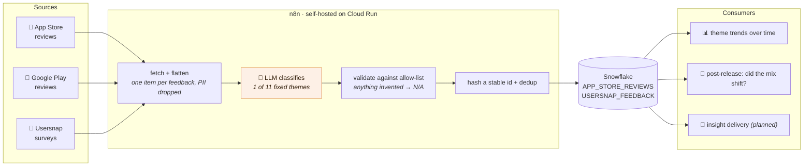

# User feedback → LLM classification → warehouse

n8n workflows that collect user feedback from app stores and survey tools, have an LLM sort each
item into a fixed list of themes, and land the result in Snowflake as queryable rows.

## What's here

```
.
├─ blog/
│  └─ learning-n8n-agentic-workflows.md   the story: why this exists and how it was built
├─ generic/                               shareable, product-neutral copies
│  ├─ feedback-pipeline-daily.json          40 nodes: iOS + Android + survey, on schedules
│  ├─ feedback-pipeline-backfill.json       35 nodes: manual history load
│  ├─ schema.sql                            the two warehouse tables
│  └─ ADAPT.md                              how to point it at your own product
├─ App Reviews - Fetch & Analyze - DND12.json   production workflow (Joyn)
└─ Usersnap Backfill - 90d V2.json              production backfill (Joyn)
```

**Want to use this?** Start with [`generic/ADAPT.md`](generic/ADAPT.md).
**Want to know why it looks like this?** Read [the blog post](blog/learning-n8n-agentic-workflows.md).

## The shape



Every branch is the same nine steps:

```
Schedule → sign JWT → fetch → flatten to one item per feedback
  → loop → LLM classifies into one of 11 themes → parse + validate against an allow-list
  → build row with a stable hashed id
  → SELECT existing ids → keep only new → If > 0 → insert
```

Note that the canvas has **two triggers, not three** — the Android branch is chained onto the end
of the iOS one. See [`generic/ADAPT.md` §2](generic/ADAPT.md) before you delete or rewire a branch.

**Before running this for real, read [`ADAPT.md` §10](generic/ADAPT.md).** Three things in here are
the first-draft version: one LLM call per item rather than ~50 per call, a dedup that no database
constraint enforces (and which is not concurrency-safe), and SQL built by string concatenation that
is only safe while its input stays hardcoded.

Three properties worth preserving if you change it:

- **The LLM's answer is validated in code** against the exact list of category names. Anything it
  invents becomes `N/A` rather than silently entering the data.
- **Every run is safe to re-run.** Dedup happens before insert, on a stable id.
- **No personal data is stored.** Reviewer names are hashed into the id and discarded; email
  addresses are deleted from survey items and scrubbed from the retained raw payload.

## Production vs generic

The two files in the root are the live Joyn workflows. The `generic/` copies are the same
structure with product names, app ids, warehouse paths and survey ids replaced by placeholders —
verified to contain none of the original identifiers, and with the 11 category names checked
byte-identical between every prompt and every validation list.

Secrets are never in these files. All credentials come from n8n credentials or `$env`.
