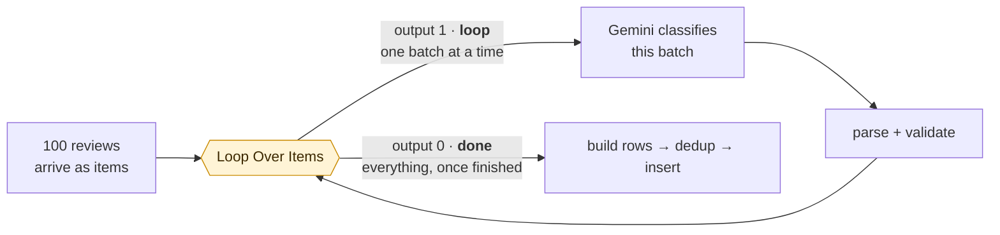
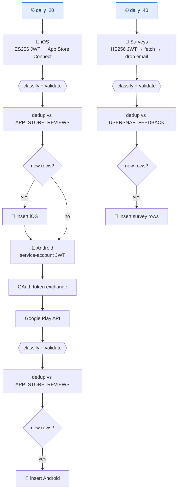
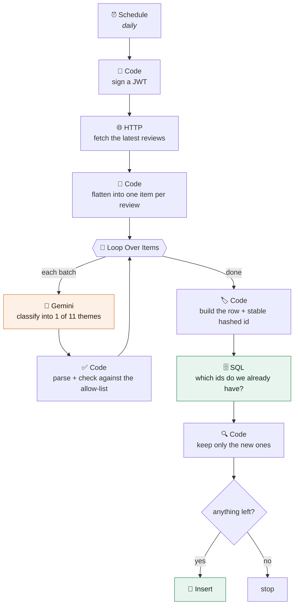
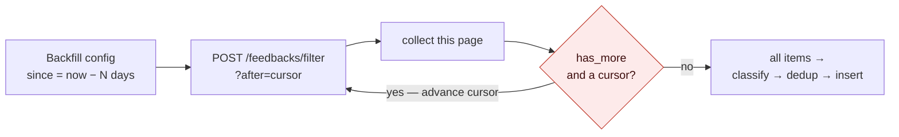

# I replaced a €15,000 research process with a weekend and €50 a month

*What I learned building my first agentic workflows in n8n.*

---

## The old world

Every big consumer app has the same quiet problem. Users are telling you exactly what's wrong,
every single day, in the app stores and in survey tools. Thousands of them. And almost nobody
reads it.

Not because teams don't care. Because reading it properly is expensive.

At Joyn, like at most companies this size, the job was done the industry-standard way. Customer
Service and User Research licensed specialist tools. A lot of the actual work was outsourced to
KPO vendors, who ran it against pre-planned SOP documents. Analysts pulled the data, cleaned it,
tagged it, and turned it into qualitative insight.

And the questions they answered were genuinely good ones:

- We shipped a release last week. Did the mix of complaints change?
- Is anyone talking about the new feature, and are they happy about it?
- Is there an idea buried in the free-text comments that we haven't thought of?
- Is sentiment moving, and can we respond at scale so people feel heard — so they can see that
  we actually act on what they tell us?

That last one matters more than it sounds. Feedback isn't a reporting exercise. It's the loop that
turns an annoyed user into someone who stays.

So the work was worth doing. The problem was everything around it.

It was **slow** — insight landed weeks after the release it described, by which point the next
release was out. It was **expensive**: ten to fifteen thousand euros a year in licences and vendor
time, for what is fundamentally *read a comment, put it in a bucket, count the buckets*. It was
**inconsistent**, because different analysts bucketed the same comment differently, so comparing
quarters partly measured your users and partly measured who did the tagging.

And it was **not queryable**. The output was a deck. You cannot filter a deck, or join one to your
release dates. When a new question came up — and it always did — you couldn't answer it, you could
only commission it.

I kept hitting that wall. A release would go out, I'd want to know that week whether playback
complaints had moved, and the honest answer was: ask, wait, and hope the question was worth
someone's month.

## Why I picked n8n

I could have written a Python script. A cron job, three API calls, an LLM, a warehouse insert.
Two hundred lines. I've written worse.

I didn't, for one reason: nobody else would ever look at it.

The people who care most about this pipeline are researchers and CS leads. A Python file is a
locked door to them. They can't see what it does, they can't suggest a change without filing a
ticket, and they certainly can't add a new source themselves.

n8n is a workflow tool where you drag nodes onto a canvas and connect them with lines. What I
underestimated is that **the canvas is the documentation**. You open it and you see: here's where
reviews come in, here's where the AI sorts them, here's where they go into the database. Nobody
needs me to explain it. That's the difference between a thing I maintain forever and a thing a team
owns.

The boring parts were also already built. Signing a JWT, calling an API with a bearer token, talking
to Snowflake, calling Gemini — all nodes, already there. I spent my time on logic, not on library
archaeology.

The third reason is the one I've become most convinced by since. With a bit of AI help, a business
user can genuinely build one of these. Not a toy — a real one. That changes who is allowed to
automate their own work.

I had never opened n8n before. The whole thing took a weekend.

## What actually confused me

Two things, and neither was the AI part.

**The loop node.** n8n's "Loop Over Items" (really Split In Batches) has *two* outputs, and which
line you drag from completely changes what your workflow does:



The counter-intuitive part is that **output 0 is the *finished* one**. The obvious reading is
"first output = first thing that happens", and it's the opposite. I spent an embarrassing amount of
time watching items go round in circles and never come out the other side. Once it clicked, every
branch I built afterwards used the same shape.

**The credentials.** Before a single row existed, I had to get through three different auth
schemes:

- **Apple** wants a JWT you sign yourself with an ES256 key, from a `.p8` file.
- **Google Play** wants a service-account JWT that you then *trade in* at Google's OAuth endpoint
  for an access token. Two steps, and the first one produces something that looks like a token but
  isn't the one you need.
- **Usersnap** wants an HS256 JWT with a key id in the header.

None of it is hard. It's that "connect to the data" is three separate puzzles you solve before you
get to do anything interesting. If you're starting out, that's your first day. Budget for it.

## How it's actually built

The main workflow is 40 nodes. It looks intimidating on the canvas, but it's really the same idea
drawn three times: once for App Store reviews, once for Google Play, once for survey feedback.



Look closely and you'll spot something I didn't design so much as end up with: Android doesn't have
its own trigger. It hangs off the end of the iOS branch, and *both* outputs of that `If` feed into
it, so it runs whether or not iOS found anything. That works, and it's wrong. A failure in the iOS
branch silently takes Android down with it. It's the first thing on the fix list, and it's a fair
illustration of how these canvases actually grow: you build one branch, the second one starts as
"just carry on from here", and nobody ever goes back to cut the string.

One branch, end to end:



Four decisions inside that are worth stealing.

### The model gets a menu, not a blank page

The prompt doesn't ask for "a category". It gives eleven exact names — *Technical Playback &
Stability Issues*, *Advertising Experience Issues*, *Value Perception & Monetization Critique* and
so on — each with a one-line definition, and says: pick one, copy the string exactly, return only
JSON.

Then, and this is the part people skip, **the code checks the answer**:

```js
const ALLOWED = new Set([
  "Technical Playback & Stability Issues",
  "Account & Subscription Management Difficulties",
  // ...9 more
]);

const category = ALLOWED.has(analysis.category?.trim())
  ? analysis.category.trim()
  : 'N/A';
```

The model's answer is a *suggestion* until my code has checked it against the list. If it invents
something plausible-sounding, that item becomes `N/A` and I can see it. This is the whole reason
the output is trustworthy enough to chart. An LLM that can quietly invent a twelfth category will
eventually give you a dashboard that's wrong in a way nobody notices.

### The ids are hashed, and the names are thrown away

Every row gets an id made by hashing the review's timestamp, the store's own id, and the reviewer's
name. The name goes into the hash and is **never stored**. Same for survey feedback: the email
address is deleted from the item *and* scrubbed out of the raw payload before the row is built.

I'd rather have a pipeline that can't leak personal data than one that promises not to.

### Every run is safe to run again

There's no fancy upsert. The workflow asks the table which ids it already has, filters those out
in code, and only inserts the rest. Boring, and it means I can re-run any branch, any time, after
any failure, without thinking about it. When you're learning a tool, "safe to re-run" is worth more
than elegant.

### One shape, three sources

The Android branch is the iOS branch with a different fetch and a different auth. The survey branch
is the same again. Once the shape exists, adding a source is an afternoon, not a project.

## The one that fought back

The backfill workflow — the one that loads history rather than yesterday — is where I hit the only
real wall.

Usersnap's history endpoint is cursor-paginated: each response tells you whether there's more and
where to continue. n8n has built-in pagination for exactly this. It didn't work on that endpoint.
It kept happily fetching page one, over and over, and reporting success. That's the worst kind of
bug: no error, just quietly incomplete data.

So I dropped into a Code node and wrote the loop by hand:

```js
while (hasMore && guard < 500) {
  const res = await this.helpers.httpRequest({ method: 'POST', url, headers, body, json: true });
  const data = Array.isArray(res) ? res[0]?.data : res?.data;
  for (const fb of data?.feedbacks ?? []) out.push({ json: fb });

  hasMore = !!data?.has_more;
  after   = data?.next?.after ?? null;
  if (!after) hasMore = false;
}
```

Fifteen lines, plus a guard so a runaway loop stops at 500 pages instead of hammering someone's API
all night.



The built-in pagination did everything in that picture except the one arrow that loops back.

That's the real lesson about low-code tools, and it isn't the one on the marketing pages. The
question isn't whether the tool covers everything — it won't. It's what happens at the exact point
where it stops. Here I replaced one node and left the rest visual. Without that escape hatch I'd
have binned the whole thing and gone back to Python.

## The bit that genuinely surprised me

Those eleven categories weren't invented for this project. They're the product of five or six years
of iteration — first people reading comments and grouping them by hand, then pre-LLM NLP clustering,
then years of arguing about the edges.

Here's the uncomfortable part. Today, you can hand a model your backlog of comments, ask it to find
the natural clusters, and get something in that neighbourhood back in an afternoon. Then apply it
on the fly to everything new.

That doesn't make the six years worthless. Somebody still has to look at the clusters and decide
which ones a team can actually *do* something about — that's product judgment, and no model has it.
But the expensive part, grinding through thousands of comments to find the shape hiding in them, is
now nearly free.

So don't inherit someone else's taxonomy. Derive your own from your own backlog, then edit it by
hand.

## What it costs and what it does

Low hundreds of items a day. Tens of thousands of rows so far.

It's self-hosted on Google Cloud Run. I first tried a plain Compute Engine VM and the bill made no
sense for something idle 23 hours a day; Cloud Run fits a workflow that wakes up, works for a few
minutes and goes back to sleep. That's a post of its own.

All in: about **fifty euros a month**, against ten to fifteen thousand a year.

That gap is the actual story. Not that a big company saved money — that a small startup, a
two-person research team, or a vendor who could never justify the licence can now have the same
capability. The floor has dropped through.

On top of it today: a dashboard of theme trends over time, and the post-release check that started
all this. Ship, look at the distribution next morning, see whether anything moved. The question that
took a month now takes a query.

## Improvements worth trying

What's next on my list:

- **Automated insight delivery.** The table is not the deliverable, the narrative is. Generating the
  deck and the digest from the data, inside n8n, so nobody assembles slides by hand.
- **Drafted responses.** The prompt already returns a suggested `response_tone` for every review —
  a thread I started and left hanging. Closing the loop back to the user is the whole point.
- **More sources.** Support tickets, social, NPS. Same eleven buckets, more inlets. That's where the
  one-shape-three-sources design pays off.
- **Alerting on spikes.** Don't wait for the weekly dashboard. If playback complaints jump the day
  after a release, that should arrive in Slack, not in a review meeting.

And the technical debt I can already see in my own canvas:

- **Batch the LLM calls.** This is the big one. Right now it's one API call per review, which is the
  most expensive way to do it and the slowest. Fifty per call would cut both by more than an order of
  magnitude. The catch is subtle enough to be worth naming: if you ask for fifty answers, you will
  sometimes get forty-nine, and if you match answers to reviews by position, one dropped item shifts
  every category after it by one. Every row still looks plausible. Every row after the gap is wrong.
  Make the model return the id alongside its answer and match on that, so a dropped item comes back
  as `N/A` where you can see it.
- **Let the database enforce the dedup.** My dedup is entirely application-level — read the existing
  ids, filter in code, insert the rest. Nothing in the table stops a duplicate. Run the backfill
  while the daily job fires over the same survey and both runs read "this is new" before either
  writes, so both insert. No error, two rows. A `MERGE` on the key fixes it properly, and it also
  stops pulling every existing id across the wire on every run, which is the other thing that won't
  survive growth.

  The trap here is assuming a primary key solves it. On Postgres it does. On **Snowflake and
  BigQuery, `PRIMARY KEY` and `UNIQUE` are informational and unenforced** — you can declare one and
  still insert the duplicate. I'd have bet money the other way.
- **Stop concatenating strings into SQL.** The survey dedup query builds its `IN (...)` list by
  gluing quoted ids together. That was safe while the list was hardcoded and mine. Then I moved the
  list into an environment variable — which is the improvement I'd been recommending, and which is
  exactly what makes concatenation start to matter. So the config node now validates every id as a
  UUID before it can reach the query. That's a guard, not a fix; query parameters are the fix.
  Worth noticing that tidying one thing quietly loaded the gun on another.
- **Add error branches.** Today one malformed item can end a run. Each item should be able to fail
  on its own and get retried. This matters more once items are batched: a failed call now loses
  fifty of them instead of one.
- **Measure the classifier.** I have no accuracy number. A few hundred hand-labelled items, checked
  against the pipeline monthly, would tell me whether quality drifts when a model version changes.
  Right now I'd find out from someone saying "this chart looks wrong".
- **Stop copy-pasting branches.** The backfill has the same branch three times, once per survey. It
  should be one branch driven by a list.
- **Cut the string between iOS and Android.** Two triggers, two independent branches. Five minutes
  of work to remove a failure mode I'd otherwise find out about the hard way.

## The thing I'd hand to my past self

Somewhere around the third branch I realised I wasn't designing any more, I was copying. Same nine
steps, different API on the front, different table on the back. So I wrote the shape down as a
prompt — one you can hand to a model along with "the source is Zendesk, the warehouse is Postgres,
here are my themes" and get a workflow JSON back.

What makes it useful isn't the outline. It's the list of constraints, and every one of them is a
scar:

- The loop node's output 0 is the *finished* one, not the first one.
- The theme names in the prompt and the theme names in the validation list must match byte for
  byte, or every row silently becomes `N/A`.
- A field only evaluates `{{ ... }}` if the string starts with `=`. Forget the `=` in a SQL query
  and it doesn't error — it just quietly doesn't substitute.
- Don't turn the classification prompt into an expression, because it contains JSON braces and n8n
  will try to parse them as templating.
- Hash the author's name into the id, then throw the name away.
- Run it twice. Zero new rows the second time is the only proof dedup works.

A model writes the eighty percent of that file which is boilerplate perfectly well. What it can't
know is which twenty percent will bite you at 2am, because that knowledge only exists in people who
have already been bitten. That's the part worth writing down, and it's the part that stays valuable
as models get better.

It's in the repo as `PROMPT.md`.

## Take it

Sanitised copies of both workflows are in [`generic/`](../generic/), with a `schema.sql`, an
`.env.example`, a `PROMPT.md` for generating your own, and an `ADAPT.md` that walks through the
credentials, the environment variables, and how to swap Snowflake for BigQuery or Postgres.

The repo also has the earlier version of this pipeline, `aura/` — BigQuery, OpenAI, drafting replies
instead of sorting themes. Same node skeleton. It's a decent illustration that none of this arrives
fully formed; you build one, live with it, and the second one is the one you'd defend.

The most important section of the guide is the one about choosing your own categories. Everything
else is plumbing. The list of buckets is the product.

If you take one thing from this: the reason this worked isn't that AI is clever. It's that AI is
now cheap enough to run on *every* comment instead of a sample, and tools like n8n are simple
enough that the person who wants the answer can build the thing that produces it.

That's a genuinely different world from the one where you file a request and wait a month.
