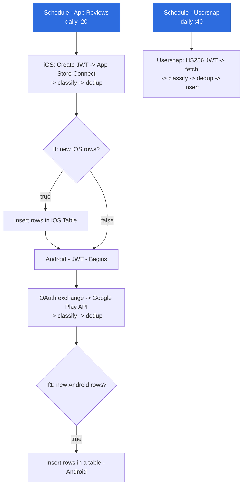
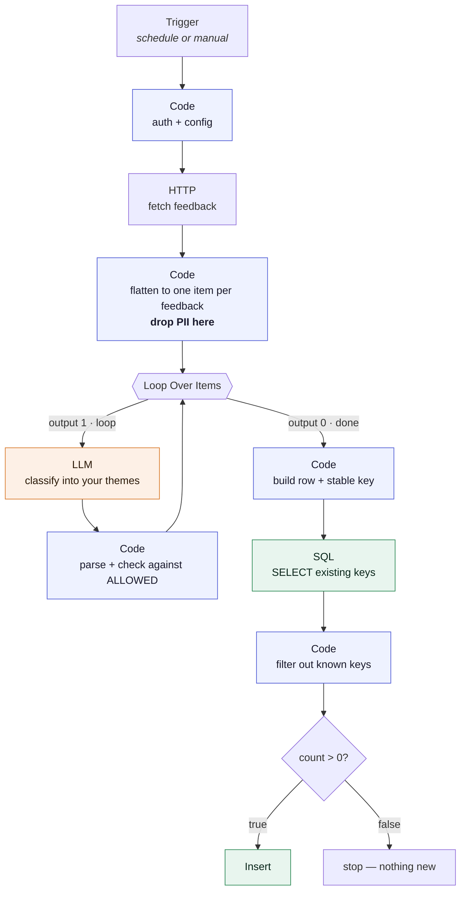
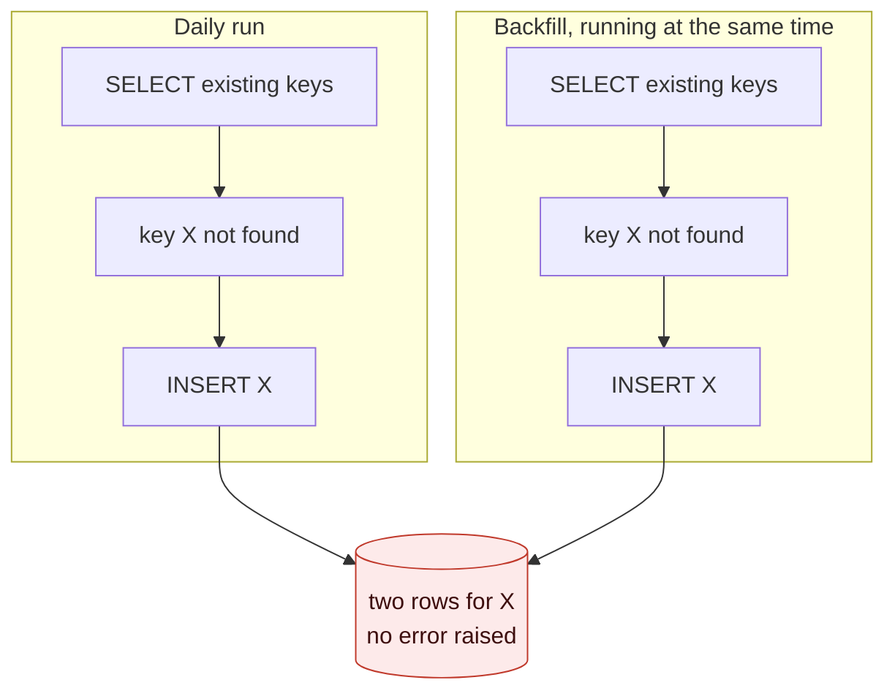

# Adapt this pipeline to your own product

Two n8n workflows that pull user feedback from three sources, have an LLM sort each item into
a fixed list of themes, and store the result in a warehouse table you can query.

They are working workflows with the product-specific bits replaced by placeholders. Nothing here
runs until you fill those in.

> **Honest caveat:** these files were sanitised and checked structurally — valid JSON, same node
> and connection counts as the originals, and the cluster names verified byte-identical between
> every prompt and every validation list. They have **not** been re-imported into a live n8n
> instance after sanitising. Expect to fix a credential mapping or two on first import.

| File | What it does |
|---|---|
| `feedback-pipeline-daily.json` | 40 nodes, two schedules: app-store reviews (iOS then Android, chained) and survey feedback |
| `feedback-pipeline-backfill.json` | 35 nodes, manual trigger, loads a history window for survey feedback |
| `schema.sql` | The two tables the workflows write into |

---

## 1. What you need before you start

- An n8n instance (self-hosted or cloud) where you can set environment variables.
- A warehouse. These files use Snowflake; see §7 to swap it.
- A Google Gemini API key. Any chat model works — see §6.
- Whichever feedback sources you actually want — but read §2 first, because the branches are not
  as independent as the canvas makes them look.

## 2. How the branches are actually wired

The canvas shows three feedback sources, which looks like three independent pipelines. It isn't.
There are **two triggers**, and the Android branch hangs off the end of the iOS one:



Note that **both** outputs of the iOS `If` node lead to `Android - JWT - Begins`. That's deliberate:
Android must run whether or not iOS found anything new. It also means:

- **Deleting the iOS branch orphans the Android branch** — it loses its trigger and silently stops
  running. If you only want Android, reconnect `Schedule - App Reviews` directly to
  `Android - JWT - Begins`.
- The survey branch has its own trigger and genuinely is independent. Delete it freely.
- A failure anywhere in the iOS branch stops Android from running at all. Splitting them onto two
  triggers is a small change and a real improvement.

There is also a trailing `Execute a SQL query` node after the Android insert
(`SELECT * ... LIMIT 1000`) that feeds nothing. It's a leftover inspection step — safe to delete.

## 3. Import and wire credentials

Import both JSON files. n8n will flag three credentials it can't resolve. Point each at your own:

| Credential name in the file | n8n credential type | Used by |
|---|---|---|
| `Snowflake account` | Snowflake | all insert + dedup nodes |
| `Google Gemini(PaLM) Api account` | Google Gemini (PaLM) API | all classify nodes |
| `JWT Auth account` | JWT Auth | `Android - JWT - Begins` only |

The `JWT Auth account` credential holds the **private key of your Google service account** (the
`private_key` field from its JSON key file), signing algorithm RS256.

## 4. Environment variables

Set these on the n8n process. Secrets are read via `$env` inside Code nodes and never stored in
the workflow file — keep it that way.

These follow the same naming as `aura/.env.example`, so both workflows in this repo can run
against one environment file. A ready-to-copy version lives in [`.env.example`](.env.example).

```bash
# Apple App Store Connect (iOS branch)
APPLE_ISSUER_ID=...              # App Store Connect > Users and Access > Integrations
APPLE_KEY_ID=...                 # the key id of your API key
APPLE_PRIVATE_KEY=...            # contents of the .p8 file, including the BEGIN/END lines
APPLE_APP_ID=...                 # numeric App Store app id, used in the fetch URL

# Google Play (Android branch)
GOOGLE_SERVICE_ACCOUNT_EMAIL=... # service account with the androidpublisher scope
GOOGLE_PLAY_PACKAGE_NAME=...     # e.g. com.example.yourapp

# Warehouse — used by the fully-qualified dedup queries
SNOWFLAKE_DATABASE=...
SNOWFLAKE_SCHEMA=...

# Survey feedback (survey branch + backfill)
USERSNAP_TOKEN=...               # the JWT signing secret
USERSNAP_JWT_KID=...             # the JWT key id
USERSNAP_SURVEYS=[{"project_id":"<uuid>","survey_name":"Web feedback survey"}]
USERSNAP_BACKFILL_DAYS=90        # backfill window; defaults to 90 if unset
```

Two things to know about how these are wired:

- **The dedup queries are n8n expressions** (they start with `=`), which is what lets
  `{{ $env.SNOWFLAKE_DATABASE }}` evaluate. If you retype one of those queries and lose the
  leading `=`, the `{{ }}` becomes literal text and the query fails.
- **The Snowflake *insert* nodes take database and schema from the credential**, not from these
  variables. Make sure the credential and `SNOWFLAKE_DATABASE`/`SNOWFLAKE_SCHEMA` agree, or you
  will dedup against one table and insert into another — which looks like the dedup silently
  not working.

## 5. The placeholders to replace

Search the imported workflows for each of these:

Almost everything is driven by the environment variables in §4, so there is only **one** literal
placeholder left to edit by hand:

| Placeholder | Where | Replace with |
|---|---|---|
| `YOUR_PRODUCT` | all 6 LLM prompts | your product's name, e.g. `Acme Music` |

Everything else — app id, package name, service-account email, warehouse database and schema, and
the survey list — now reads from `$env` and needs no edit inside the workflow.

**Why the prompts are the exception.** An n8n field only evaluates `{{ ... }}` when it is an
expression, and the classification prompts contain literal `{` and `}` characters (they specify a
JSON response shape). Turning those fields into expressions would make n8n try to parse that JSON
schema as templating and break the prompt. So the product name stays a plain string you edit once.
It is also the field you are most likely to want to reword anyway.

## 6. The part that matters most: your themes

The pipeline is only as useful as its list of categories. The 11 shipped here came from years of
iteration on one streaming product. **Yours will be different, and that is the point.**

The list appears in two places per branch, and they must match **exactly** — same spelling, same
punctuation, same `&` vs `and`:

1. In the **prompt** of each classify node (`Analyze Sentiment - OpenAI1`, `Message a model`,
   `Categorize Feedback*`).
2. In the `const ALLOWED = new Set([...])` line of each parse node (`Parse Sentiment1`,
   `Parse Sentiment2`, `Parse Category*`).

The parse node checks the model's answer against that Set and falls back to `N/A` if it doesn't
match. That's deliberate: a model will occasionally invent a plausible-sounding category, and a
category nobody defined is worse than an explicit "uncategorised". If you edit the prompt and
forget the Set, **every** item silently becomes `N/A` — that mismatch is the single most likely way
to break this pipeline.

**How to derive your own list:** export a few hundred real comments, paste them into a chat model,
and ask it to cluster them into 8–12 named themes with one-line definitions. Read the result and
edit it — merge near-duplicates, split anything too broad to act on, and keep three structural
buckets that are easy to forget:

- one for praise (otherwise positive feedback gets forced into a complaint bucket),
- one for genuinely uncategorisable input (gibberish, a bare email address, an empty answer),
- one for vague dissatisfaction with no actionable detail (this bucket will be bigger than you expect).

Then paste the final list into both places, everywhere.

**Changing the model:** replace the Gemini nodes with any chat node. The parse nodes read the
response at `content.parts[0].text` (Gemini's shape) and fall back to a plain string, so an
OpenAI-style node needs one line changed in each parse node.

## 7. Swapping the warehouse

The database only appears in two node types, so this is a small job.

**BigQuery.** Replace each `Snowflake` node with a `Google BigQuery` node.

- Dedup queries: `SELECT DISTINCT id FROM \`project.dataset.app_store_reviews\` WHERE platform = 'apple_app_store'`
- Inserts: BigQuery's node takes records as JSON, so the ordered `columns` string is not needed —
  but keep the `Build ... Row` / `Add Unique ID` nodes, since they set the field names.
- Watch the aliasing: the Snowflake queries use `SELECT DISTINCT id AS "id"` to force a lowercase
  key, because Snowflake upper-cases unquoted identifiers. BigQuery preserves case, so drop the alias
  and check the `Check Duplicates` nodes still read `item.json.id`.

**Postgres.** Replace with `Postgres` nodes; the SQL is unchanged apart from the alias note above.
Easiest option if you want to try this locally without a warehouse account.

**Any warehouse.** The dedup pattern is: `SELECT DISTINCT <key>` → filter in a Code node →
`If count > 0` → insert. It pulls every existing key on every run, which is fine for tens of
thousands of rows and wrong for millions — and it is not safe against concurrent runs on any
engine. See §10.2 for why, and for the `MERGE` that replaces it.

## 8. Adding a different source

To add Zendesk, Trustpilot, an NPS tool, or anything else, copy the survey branch and change four
nodes. The shape that makes it work:



**The two loop outputs are the thing to get right.** Output `0` is *done* and carries every item
once the loop finishes; output `1` is *loop* and carries one batch at a time. The classify step
hangs off output 1 and feeds back into the loop; the rest of the pipeline hangs off output 0.

Two things to get right in the flatten node:

- **Emit one item per feedback**, with a stable unique key. If your source has no reliable id, hash
  one from fields that don't change (see `Add Unique ID` for the pattern — it hashes timestamp, id
  and author, then stores only the hash).
- **Drop personal data here, not later.** The survey flatten node deletes `email` from the item and
  from the copy it keeps in `raw_payload`. Do the same for whatever your source exposes.

## 9. Schedules and volume

Both scheduled branches run every 24 hours, offset by 20 minutes so they don't collide. The fetch
limits are deliberately small (100 reviews, 20 survey items) because the daily job only needs to
catch up since yesterday; the dedup step makes a re-run harmless. Use the backfill workflow for
history instead of widening the daily fetch.

The backfill's window is `USERSNAP_BACKFILL_DAYS` (default 90). It contains three near-identical
branches, one per survey: branch 1 reads `USERSNAP_SURVEYS[0]`, branch 2 `[1]`, branch 3 `[2]`.
Configure fewer surveys and the spare branches return nothing rather than failing. That indexing is
copy-paste rather than good design — with more than three surveys, make it one branch driven by the
whole list.

Its `Fetch All Feedback (paginated)` node is a hand-written `while (has_more)` loop rather than
n8n's built-in HTTP pagination, because the built-in one did not advance the cursor on that
particular POST endpoint. It has a 500-page safety guard (50k rows). If you point it at a bigger
history, raise the guard on purpose rather than wondering why the data stops.

## 10. Known weak spots, and what to do about them

These workflows work, but three things in them are the first-draft version. If you're running this
for real, fix them in this order.

### 10.1 One LLM call per item is the expensive mistake

Right now `Loop Over Items` runs with the default batch size, so every single review costs one
round trip to the model. At a few hundred items a day that's tolerable. It's also the single
biggest lever on both cost and runtime, and the fix is not hard.

**Classify ~50 at a time instead.** Set the batch size on `Loop Over Items` to `50`, then change
the prompt to take a list and return a list:

```
Classify each item below. Return ONLY a JSON array, one object per input item,
in this shape: [{"id": "<the id you were given>", "category": "<one of the 11>"}]
Return exactly one object per input id. Do not merge, skip, or reorder items.

Items:
[{"id":"a1b2","text":"..."},{"id":"c3d4","text":"..."}]
```

Build that input array in a Code node with `$input.all().map(...)`, then in the parse node map the
answers back **by id**:

```js
const byId = new Map(parsed.map(r => [r.id, r.category]));

return $input.all().map(item => {
  const suggested = byId.get(item.json.id);
  return { json: {
    ...item.json,
    category: ALLOWED.has(suggested?.trim()) ? suggested.trim() : 'N/A',
  }};
});
```

**Match on id, never on array position.** A model asked for 50 answers will sometimes return 49.
If you zip by index, one dropped item silently shifts every category after it by one — every row
still looks plausible and the whole batch is wrong. Matching by id makes a dropped item come back
as `N/A`, which is visible.

Two things to watch: keep batches small enough that the response fits comfortably in the output
token limit, and remember a failed call now loses 50 items instead of 1, so this pairs naturally
with §10.3.

### 10.2 Nothing in the database enforces the dedup

The dedup is entirely application-level: `SELECT` the existing keys, filter in a Code node, insert
what's left. **There is no constraint stopping a duplicate.**



Both runs read before either writes, so both believe the key is new. Run the backfill while the
daily schedule fires over the same survey and you get duplicates, silently.

Adding a primary key helps on **Postgres**, where it is enforced. On **Snowflake and BigQuery,
`PRIMARY KEY` and `UNIQUE` are informational only and are not enforced** — declaring one documents
intent and will not stop a single duplicate row. That surprises people, so check it on your engine
rather than assuming.

The fix that works everywhere is to replace the `SELECT` → filter → `If` → `Insert` chain with a
single `MERGE ... WHEN NOT MATCHED THEN INSERT` on the key. It's atomic, it's safe under
concurrency, and it stops pulling every existing key across the wire on every run — which is the
other reason this pattern won't scale. See the block at the bottom of `schema.sql`.

Until you do that, the cheap mitigation is: don't run the backfill and the daily job over the same
source at the same time.

### 10.3 The SQL is built by string concatenation

The five `Execute a SQL query - Usersnap*` nodes build their filter like this:

```js
WHERE project_id IN ({{ $('...').all().map(s => "'" + s.json.project_id + "'").join(',') }})
```

That is string interpolation into SQL, and the project ids now come from `USERSNAP_SURVEYS` in the
environment rather than a hardcoded list — so the values reaching that query are no longer literals
sitting in the file.

**The config nodes therefore validate them before use**, which is the mitigation this section used
to only recommend:

```js
const UUID = /^[0-9a-fA-F-]{36}$/;
for (const s of SURVEYS) {
  if (!UUID.test(String(s.project_id || ''))) {
    throw new Error('Refusing to use a project_id that is not a UUID: ' + s.project_id);
  }
}
```

An environment variable is operator-controlled, so this is defence in depth rather than a live
hole. It stops mattering the moment the list comes from somewhere less trusted — an API response,
a database table, a webhook — which is exactly the direction §8 pushes you.

**The stronger fix, still worth doing:** pass the ids as query parameters instead of interpolating
them, or query one project per item with `WHERE project_id = ?`. Validation rejects bad input;
parameters make the question moot.

The same applies to any new source you add in §8. The habit worth keeping: a value that came from
outside your workflow never gets concatenated into SQL.

## 11. First run

1. Run `schema.sql` (adapted) against your warehouse.
2. Disable every branch but one — easiest is to open one trigger and execute from there.
3. Execute it manually and watch the item counts between nodes. The usual first failure is auth;
   the second is an empty `category` column, which means the prompt and the `ALLOWED` Set disagree.
4. Check the rows landed, then run it a second time. **Zero new rows on the second run** is the
   signal that dedup works.
5. Only then turn the schedules on.
